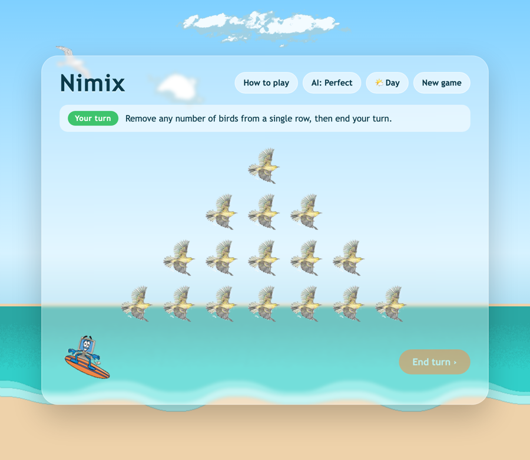

# Nimix 🏄🪶

> A beach-themed take on the ancient game of **Nim** — play _misère_ Nim against an unbeatable AI, right in your browser.

[](https://danmat.github.io/Nimix/)
&nbsp;


<p align="center">
  
</p>

## What is Nim?

Nim is one of the oldest strategy games in the world. Nimix is the **misère** variant, played on the beach with birds:

- The birds start in four rows of **1, 3, 5 and 7**.
- On your turn, remove **any number of birds — but all from a single row**.
- Press **End turn** and the surfing computer answers.
- Whoever is forced to take the **very last bird loses**.

The secret is the **nim-sum** (the XOR of the row sizes). Perfect play keeps handing your opponent a nim-sum of zero — the AI on _Perfect_ mode knows it, so it can't be beaten from the standard start. Switch to _Easy_ for a fighting chance!

## Features

- 🧠 **Optimal misère AI** — a real nim-sum strategy, not a random mover.
- 🎚️ **Difficulty toggle** — _Perfect_ (unbeatable) or _Easy_ (beatable).
- 🏄 **Auto-playing opponent** — the surfer responds on its own after you end your turn.
- 🌤️ **Day / Dusk / Night themes** — change the time of day on the beach.
- 📖 **In-game "How to play"** — learn the rules and the strategy.
- ⌨️ **Keyboard support** — `Enter` ends your turn, `N` starts a new game.
- 📱 **Responsive** — plays on phones, tablets and desktops.
- 🍦 **Zero dependencies** — plain HTML, CSS and JavaScript (the original used jQuery).

## Play locally

It's a static site — no build step. Clone and open `index.html`, or serve the folder:

```bash
git clone https://github.com/DanMat/Nimix.git
cd Nimix
python3 -m http.server 8000   # then visit http://localhost:8000
```

## How it works

- **`js/game.js`** — the game engine: turn state machine, board rendering, and the misère-Nim AI (`bestMove`).
- **`css/style.css`** — the animated beach backdrop (pure CSS), the board, themes and overlays.
- **`images/`** — the birds, clouds, waves and the surfing computer.

## Credits

Rebuilt in vanilla JavaScript from the original 2011 jQuery version. Artwork and the surfing-computer mascot are from the original game.

## License

[MIT](LICENSE) © DanMat
